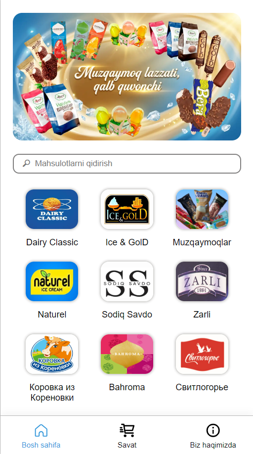

# 🍦 Muzqaymoq Catalog — Telegram Web App

A production-ready ice cream catalog and ordering system built as a Telegram Web App, with a full admin panel for product management.

---

## Overview

This app lets customers browse ice cream products by brand directly inside Telegram. Admins manage the entire catalog through a separate secured panel — adding, editing, and deleting products with image uploads, all backed by a live Supabase database.

---

## Features

### Customer Side
- Browse products organized by brand
- View product details: name, weight, price, description, gallery images
- Add products to cart with quantity selection
- Send order summary directly to Telegram

### Admin Panel
- Secure login with SHA-256 password hashing
- 24-hour session management
- Add new products with main image and gallery upload
- Edit existing products including image replacement
- Delete products with confirmation
- Live product count on dashboard
- Brand-based product filtering and search
- First-time setup page for creating admin account

---

## Tech Stack

| Layer | Technology |
|---|---|
| Frontend | Vanilla HTML, CSS, JavaScript |
| Database | Supabase (PostgreSQL) |
| File Storage | Supabase Storage |
| Hosting | Vercel |
| Platform | Telegram Web App API |

---

## Project Structure

```
├── index.html              # Customer catalog
├── script.js               # Main app logic, Supabase data fetch
├── cart.js                 # Cart class, order generation
├── style.css               # Global styles
├── admin-login.html/js     # Admin authentication
├── admin-setup.html/js     # First-time admin account creation
├── admin-dashboard.html/js # Admin home, product count stats
├── admin-brand-select.html/js  # Brand picker for add/manage flows
├── admin-product-form.html/js  # Add new product form
├── admin-product-list.html/js  # Product list with edit/delete
└── admin-product-edit.html/js  # Edit existing product
```

---

## Notes

- This is a private repository. API keys are currently stored client-side and should be moved to a backend proxy before any public exposure.
- Existing catalog images are served from Vercel (committed to repo). New uploads go to Supabase Storage.
- The app is fully functional on mobile inside Telegram and on desktop browsers.


### Preview



---

[🍦 View the Product](https://arzonbozor-muzqaymoq-51yvv96k8-anvars-projects-6cd98a1b.vercel.app/)